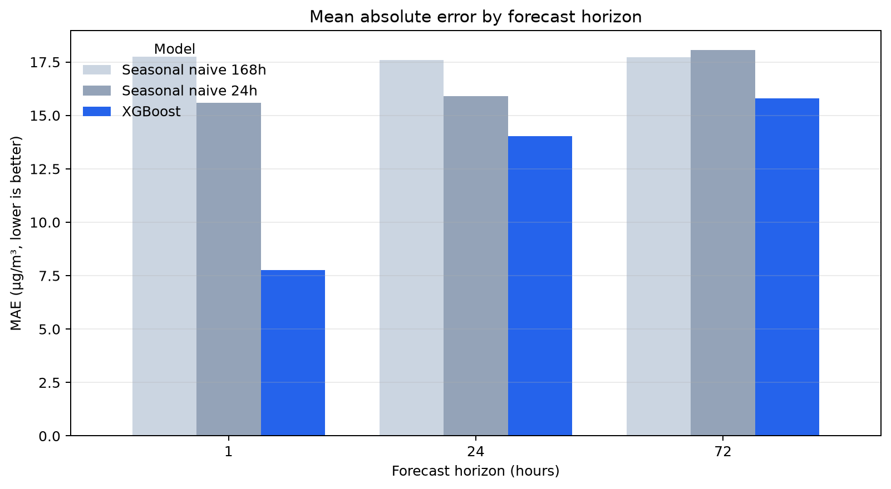
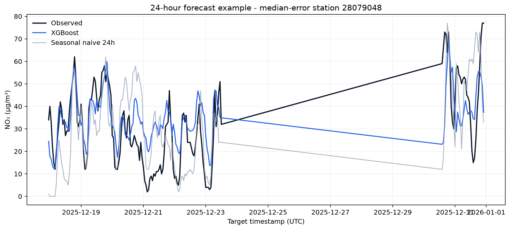
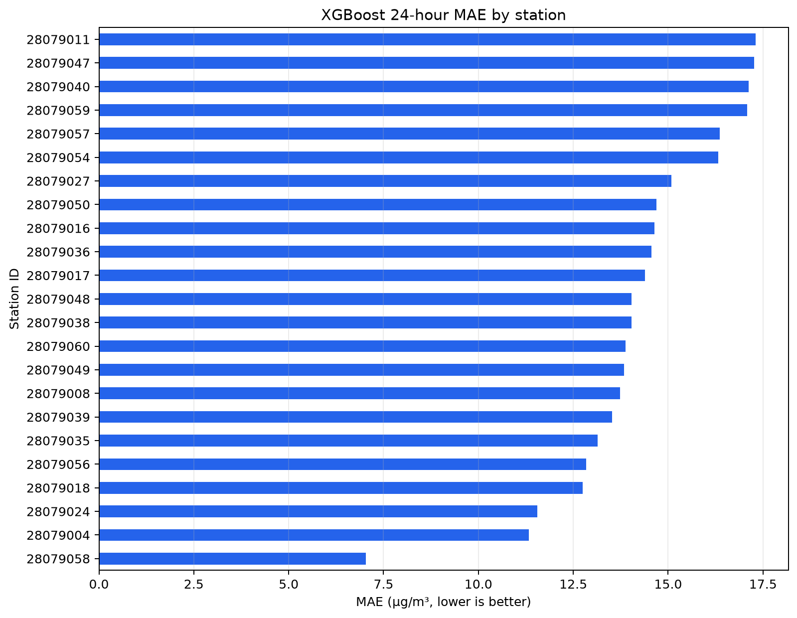
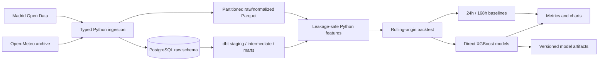

# Madrid NO2 Forecasting

[](https://github.com/carleondel/madrid_pollution_project/actions/workflows/ci.yml)
[](https://www.python.org/)
[](https://docs.astral.sh/uv/)
[](https://www.getdbt.com/)

An end-to-end data and machine-learning pipeline that ingests official Madrid
air-quality observations and forecasts station-level NO2 concentrations 1, 24,
and 72 hours ahead.

The project is designed around a less glamorous but more important goal than
trying many algorithms: produce honest, reproducible time-series evaluation
without target or future-weather leakage.

## Results

The current benchmark uses **1,649,766 valid hourly observations** from the 2018-2025
official source years. One global XGBoost model is trained per forecast horizon and
evaluated with three rolling-origin folds over the final six weeks of 2025.

| Horizon | XGBoost MAE | Best naive MAE | Improvement | XGBoost RMSE |
|---:|---:|---:|---:|---:|
| 1 hour | **7.76** | 15.60 | **50.2%** | 10.51 |
| 24 hours | **14.02** | 15.90 | **11.8%** | 17.10 |
| 72 hours | **15.80** | 17.71 | **10.8%** | 18.92 |

Errors are expressed in micrograms per cubic metre. The comparison includes
24-hour and 168-hour seasonal-naive baselines. Results are averages across three
14-day validation folds; the training window for each fold is capped at two years.



The result is deliberately not presented as a solved problem. XGBoost provides a
large improvement at one hour, while the margin over strong seasonal baselines is
much smaller at 24 and 72 hours.



Error also varies materially between stations, which is hidden by a single global
score:



## Product Contract

The pipeline trains one global direct model per horizon using all eligible
stations. It produces separate station-level predictions.

```text
Observation grain:
station_id + observed_at

Prediction grain:
station_id + prediction_created_at + target_at + horizon_hours + model_version
```

Latest-prediction output excludes stations more than 14 days behind the freshest
station observation, preventing formally valid but operationally stale forecasts.

## Architecture



dbt owns stable analytical grains, documentation, source relationships, and data
quality. Python owns target construction, temporal features, backtesting, model
training, and prediction.

## Data Sources

### Air quality

[Madrid Open Data hourly air-quality observations](https://datos.madrid.es/dataset/201200-0-calidad-aire-horario)
are the source of truth for NO2. The ingestion layer handles:

- Annual ZIP resources and the combined current CSV resource.
- Nested archive paths and monthly CSV members.
- UTF-8 and legacy Latin-1 files.
- The official `MAGNITUD = 8` NO2 code.
- Hour-level `Vxx` validity flags.
- Changing station availability.
- Europe/Madrid daylight-saving transitions.
- UTC normalization and requested-year filtering.

### Weather

[Open-Meteo Historical Weather](https://open-meteo.com/en/docs/historical-weather-api)
provides hourly temperature, humidity, precipitation, pressure, wind speed, and
wind direction for central Madrid.

Weather is ingested for analytical use but is intentionally excluded from the
current forecast model. Historical observations at `target_at` would not have
been known at `prediction_created_at`; using them would inflate backtest results.

## Forecasting Methodology

### Features available at prediction time

- Cyclical hour, weekday, and day-of-year encoding.
- Weekend indicator.
- Station ID, station type, coordinates, and altitude.
- NO2 lags at 1, 2, 3, 24, 48, 72, and 168 hours.
- Shifted rolling means and standard deviations over 3, 24, and 168 hours.

Every rolling statistic is calculated after a one-hour shift. The current or
future target can therefore never enter its own predictors.

### Direct horizons

The project trains an independent model for each of `t+1`, `t+24`, and `t+72`.
This avoids recursively feeding earlier predictions into later horizons.

### Backtesting

Random train/test splitting is never used. Each rolling-origin fold obeys:

```text
maximum training target_at < validation prediction_created_at
```

That target-availability embargo is tested directly in `pytest`. Metrics include
MAE, RMSE, MASE, and sMAPE overall and by station.

## Data Model

```text
raw.air_quality
raw.stations
raw.weather
        |
        v
staging.stg_air_quality
staging.stg_stations
staging.stg_weather
        |
        v
intermediate.int_station_hourly
        |
        +--> marts.fct_no2_observations
        +--> marts.mart_station_daily
```

dbt includes source freshness, not-null, uniqueness, relationship, non-negative,
and singular grain tests. SQL is checked with SQLFluff.

## Quick Start

Requirements:

- Python 3.12 (installed automatically by `uv` when needed)
- [`uv`](https://docs.astral.sh/uv/)
- Docker with Compose for the PostgreSQL/dbt path
- `libomp` on macOS for XGBoost: `brew install libomp`

```bash
git clone https://github.com/carleondel/madrid_pollution_project.git
cd madrid_pollution_project
cp .env.example .env
make setup
make quality
```

### Lightweight Parquet demo

This path does not require PostgreSQL:

```bash
make ingest-local
make train-quick
make predict
make report
```

### Full pipeline

```bash
make up
make ingest
make dbt-build
make train
make predict
make report
make demo
```

`make demo` regenerates predictions and report assets from existing data/models,
then runs linting and tests. Data downloads, model binaries, and generated reports
are intentionally excluded from Git.

## Useful Commands

| Command | Purpose |
|---|---|
| `make setup` | Install all locked dependency groups with uv |
| `make ingest-local` | Download a small Parquet-only demo dataset |
| `make ingest` | Rebuild the full PostgreSQL and Parquet source layer |
| `make dbt-parse` | Validate dbt structure without executing SQL |
| `make dbt-build` | Build and test all analytical models |
| `make train-quick` | Run a reduced modeling smoke test |
| `make train` | Run the full backtest and train final models |
| `make predict` | Generate latest predictions for fresh stations |
| `make report` | Regenerate metrics summaries and README charts |
| `make quality` | Run Ruff and pytest with coverage |

## Repository Structure

```text
.
├── dbt/                         # Sources, staging, intermediate, marts, tests
├── docs/assets/                 # Reproducible README figures
├── infra/docker-compose.yml     # Local PostgreSQL
├── notebooks/legacy/            # Preserved exploratory research
├── src/madrid_pollution/
│   ├── data/                    # Downloading, parsing, storage
│   ├── modeling/                # Features, backtesting, training, prediction
│   ├── cli.py                   # Stable command-line interface
│   ├── config.py                # Typed environment configuration
│   ├── pipeline.py              # Ingestion orchestration
│   └── reporting.py             # Metrics and portfolio figures
├── tests/                       # Unit and leakage-control tests
├── PLAN.md                      # Execution contract and phase gates
├── pyproject.toml
└── uv.lock
```

## Current Status

| Component | Status |
|---|---|
| Reproducible package, lockfile, linting, tests, CI | Complete |
| Official data ingestion and Parquet rebuild | Complete |
| PostgreSQL loading | Implemented; local Docker integration gate pending |
| dbt models, contracts, docs, tests, SQLFluff | Implemented and parsed |
| `dbt build` against PostgreSQL | Pending Docker integration gate |
| Leakage-safe baselines, XGBoost, backtesting | Complete |
| Versioned artifacts, latest predictions, report assets | Complete |
| FastAPI | Post-MVP |
| Airflow and dashboard | Optional post-MVP |

See [PLAN.md](PLAN.md) for the scope decisions and remaining gates.

## Limitations

- The model does not yet consume genuine future weather forecasts.
- The current benchmark covers completed source years through 2025, not live 2026
  operations.
- Forecasts are point estimates without prediction intervals.
- One global model may underperform a specialized model for unusual stations.
- A central-Madrid weather grid cell does not capture every station microclimate.
- The project makes no causal claim about Madrid Central or other policy changes.
- Deep learning and advanced MLOps infrastructure are intentionally outside the MVP.

## Historical Context

This project started as a 2018 interview exercise. The original notebooks are kept
under `notebooks/legacy/` as research history, while production behavior now lives
in typed, tested modules with executable quality gates.
