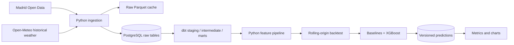

# Madrid NO2 Forecasting

An end-to-end data and machine-learning project for station-level nitrogen dioxide
forecasting in Madrid. The target architecture ingests official observations,
builds tested analytical datasets, and forecasts NO2 concentrations 1, 24, and 72
hours ahead without using information unavailable at prediction time.

> **Status:** active MVP development. The historical notebooks are exploratory;
> production modules and reproducible outputs are being implemented phase by phase.

## Why This Project

Air-pollution forecasting is a useful time-series problem with several traps that
are easy to hide in a notebook: changing source formats, daylight-saving time,
station churn, strong seasonal baselines, and leakage from future weather. This
repository treats those constraints as part of the product rather than optimizing
only for a headline model score.

## Current Component Status

| Component | Status |
|---|---|
| Historical EDA | Available as legacy notebooks |
| Reproducible Python package | In progress |
| Official Madrid Open Data ingestion | Pending |
| PostgreSQL raw storage | Basic local service |
| dbt analytical models | Pending |
| Leakage-safe forecasting | Pending |
| End-to-end demo | Pending |
| FastAPI | Post-MVP |
| Airflow and dashboard | Optional post-MVP |

The full execution contract and phase gates are documented in [PLAN.md](PLAN.md).

## Product Definition

The MVP will train one global model per horizon using all eligible stations and
will generate a forecast for each station.

```text
Observation grain:
station_id + observed_at

Prediction grain:
station_id + prediction_created_at + target_at + horizon_hours + model_version
```

Forecast horizons are 1, 24, and 72 hours. XGBoost will be compared against
24-hour and 168-hour seasonal-naive baselines using rolling-origin backtesting.

## Target Architecture



dbt owns analytical cleanup and stable table grains. Python owns target creation,
lags, rolling windows, backtesting, training, and prediction so leakage controls can
be tested directly.

## Leakage Policy

The MVP may ingest historical weather for analysis, but it will not use observed
weather from between `prediction_created_at` and `target_at`. Initial models use
only information available at prediction time. A later experiment may add genuine
weather forecasts or lagged weather and compare their incremental value.

## Local Development

Requirements:

- `uv`
- Docker with Compose for PostgreSQL phases

```bash
cp .env.example .env
make setup
make status
make quality
```

The complete MVP workflow will eventually be:

```bash
make setup
make up
make ingest
make dbt-build
make train
make predict
make test
make demo
```

Commands that are not implemented yet remain phase-gated in `PLAN.md` rather than
pretending that the pipeline is complete.

## Data Sources

- [Madrid Open Data hourly air-quality observations](https://datos.madrid.es/portal/site/egob/menuitem.c05c1f754a33a9fbe4b2e4b284f1a5a0/?vgnextchannel=374512b9ace9f310VgnVCM100000171f5a0aRCRD&vgnextfmt=default&vgnextoid=f3c0f7d512273410VgnVCM2000000c205a0aRCRD)
- [Open-Meteo Historical Weather API](https://open-meteo.com/en/docs/historical-weather-api)

## Known Limitations

- The production pipeline and published benchmark metrics are not complete yet.
- Open-data formats can differ by year and require explicit parser fixtures.
- Historical weather observations are not equivalent to weather forecasts that
  would have been available in real time.
- The project makes no causal claim about Madrid Central or other policy changes.
- Deep-learning models and advanced MLOps infrastructure are intentionally outside
  the MVP.

## Repository History

The project began as an interview exercise based on 2018 data. Existing notebooks
are retained as historical research material while each useful transformation is
replaced by tested production code.
